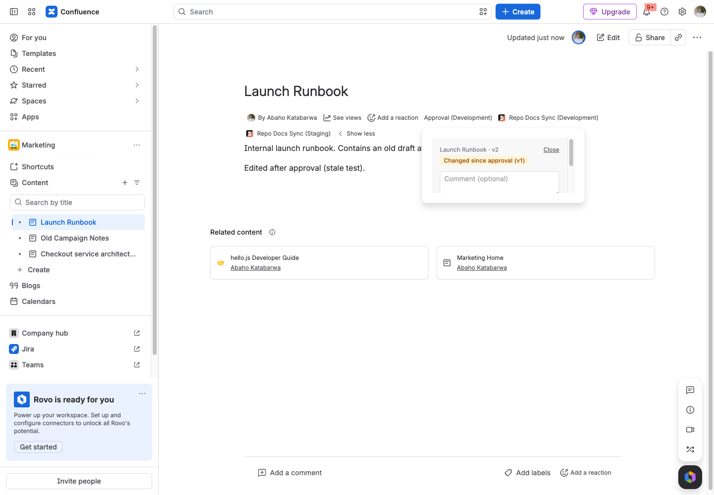
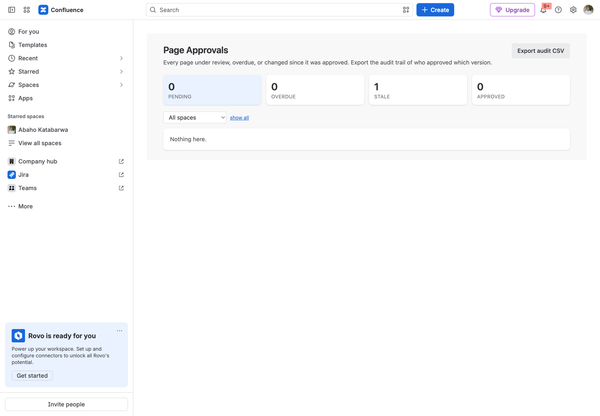

# Page Approvals for Confluence

Request, approve and reject pages with per-space approvers and a quorum. Badge on every page, stale detection when an approved page changes, dashboard, audit CSV.

Runs entirely on Atlassian: no vendor servers, no data egress. Support: support@llmgraph.ai.

## Before you start

- Confluence Cloud site, and the permission to install apps (site or product admin).
- No accounts or credentials outside Atlassian are needed.

## 1. Install the app on your Confluence site.

## 2. In a space: Space settings, Page approvals. Add approvers by Atlassian account id or by group name, set how many approvals a page needs, list the labels that require approval (for example policy, sop), and how many days until a request is overdue. Save.

## 3. On a page, click Approval in the byline. Anyone who can edit the page can Request approval (with a comment).

## 4. Approvers see Approve v{n} and Reject in the same dialog. Once the required number approve, the page shows Approved v{n}.

## 5. Edit an approved page: the badge switches to "Changed since approval" until it is approved again.

## 6. Apps, Page Approvals shows pending, overdue, stale and approved pages across spaces and exports the audit trail as CSV.

## 7. Search with CQL: katabarwaApprovalState = "approved".

## What the app stores

Per-space configuration (approver account ids and group names, quorum, labels, due days, two rules); one approval record per page (page id, space id, title, state, requested and approved versions, requester account id, decisions with approver account id, display name, timestamp and comment, a bounded history of events). A content property named katabarwa_approval with the state and approved version is written on each page that has been through the flow.

## Limits

No email reminders (the app has no egress); the dashboard's overdue view is the reminder. Approvals do not block publishing; Confluence has no publish gate an app can enforce. The dashboard shows only pages the viewer can read.

## Search with CQL

`katabarwaApprovalState = "approved"` (also `pending`, `rejected`, `stale`) and `katabarwaApprovedVersion >= 3`. The value is written whenever someone requests, approves, rejects or withdraws; after a page edit it can lag the badge until the next action on that page.

## Troubleshooting

| Symptom | Cause | Fix |
|---|---|---|
| Nothing appears after install | The app has not been configured yet | Follow steps 2 to 4 above |
| A person does not see what an admin configured | They lack permission on the underlying content; the app never widens access | Grant the Atlassian permission first |
| An action fails with an HTTP error in the message | Jira or Confluence rejected the request (permission, validation, rate limit) | The message quotes the endpoint and status; retry after fixing the cause or contact support with the text |

## Permissions the app asks for

- `storage:app`: approval records + space config
- `read:page:confluence`: GET /wiki/api/v2/pages/{id} (title, space, version; also as the user to confirm readability), GET /wiki/api/v2/pages/{id}/properties
- `write:page:confluence`: POST/PUT /wiki/api/v2/pages/{id}/properties: the indexed approval-state property (nothing else is written)
- `read:label:confluence`: GET /wiki/api/v2/pages/{id}/labels (labels-that-require-approval rule)
- `read:space:confluence`: GET /wiki/api/v2/spaces (dashboard filter, space-settings key -> id)
- `read:content-details:confluence`: v1 GET /wiki/rest/api/content/{id}?expand=operations, as the user: edit permission before a request
- `read:confluence-content.summary`: required by the avi:confluence:updated:page trigger (lint rule permission-scope-required)
- `read:confluence-user`: v1 GET /wiki/rest/api/user/current (as the user) and /wiki/rest/api/user?accountId= (names)
- `read:confluence-groups`: v1 GET /wiki/rest/api/user/memberof, as the user (group-based approvers)
