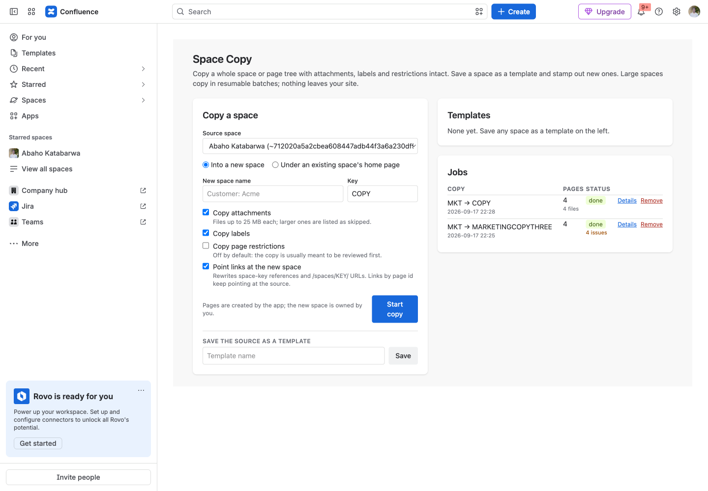
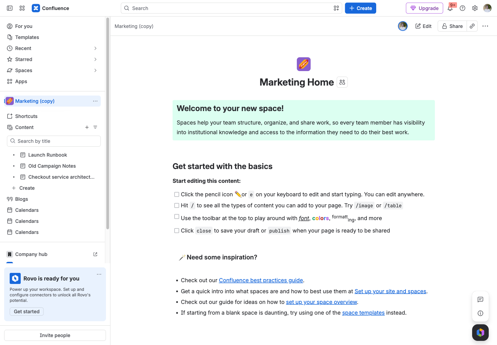

# Space Copy & Templates for Confluence

Copy a whole space or any page tree with attachments, labels and restrictions intact, save a space as a template, and watch progress. Nothing leaves your site.

Runs entirely on Atlassian: no vendor servers, no data egress. Support: support@llmgraph.ai.

## Before you start

- Confluence Cloud site, and the permission to install apps (site or product admin).
- No accounts or credentials outside Atlassian are needed.

## 1. Install the app on your Confluence site.

## 2. Open Apps, Space Copy. Pick the source space. You only see spaces you can read.

## 3. Choose Into a new space (name and key) or Under an existing space's home page.

## 4. Tick what to bring along: attachments (up to 25 MB each), labels, page restrictions (off by default), and whether links should point at the new space.

## 5. Start copy. The new space is created as you; pages are copied in batches of twenty and the Jobs panel refreshes until it is done. Details lists any page or file that could not be copied and why.

## 6. Templates: type a name under Save the source as a template. Later, Use creates a new space from it with the same options.

## 7. From any page, Actions (…), Copy page tree copies that page and everything under it into a space and parent you choose.

## What the app stores

Jobs (source and target space keys and ids, root page id and title, options, the queue of page ids still to copy, counters, up to 200 problem entries with page id, title and error text, the requester's account id and group names at start time); a source-to-target page id map per job; templates (name, source space key, options). Page bodies and attachment bytes pass through the function and are never stored.

## Limits

Links by page id keep pointing at the source (new ids are only known when the copy ends). Blog posts, comments, page history and space permissions are not copied; the new space gets the creator's defaults. Attachments above 25 MB are listed as skipped. Trees above 4,000 pages stop with an explicit message.

## Troubleshooting

| Symptom | Cause | Fix |
|---|---|---|
| Nothing appears after install | The app has not been configured yet | Follow steps 2 to 4 above |
| A person does not see what an admin configured | They lack permission on the underlying content; the app never widens access | Grant the Atlassian permission first |
| An action fails with an HTTP error in the message | Jira or Confluence rejected the request (permission, validation, rate limit) | The message quotes the endpoint and status; retry after fixing the cause or contact support with the text |

## Permissions the app asks for

- `storage:app`: jobs, page id maps, templates
- `read:space:confluence`: GET /wiki/api/v2/spaces (listed as the user: only readable spaces are offered)
- `read:page:confluence`: GET /wiki/api/v2/pages/{id}?body-format=storage, .../children (as the user for the root check)
- `write:page:confluence`: POST /wiki/api/v2/pages, PUT /wiki/api/v2/pages/{id} (target home page)
- `read:label:confluence`: GET /wiki/api/v2/pages/{id}/labels
- `read:attachment:confluence`: GET /wiki/api/v2/pages/{id}/attachments + attachment bytes via the download link
- `write:confluence-space`: v1 POST /wiki/rest/api/space to create the target space, as the user
- `write:label:confluence`: v1 POST /wiki/rest/api/content/{id}/label on the copies
- `write:attachment:confluence`: v1 POST /wiki/rest/api/content/{id}/child/attachment (upload copied attachments)
- `read:content-details:confluence`: v1 GET /wiki/rest/api/content/{id}/restriction/byOperation: copy restrictions when asked, and confirm on every source page that the requester may read it
- `write:content.restriction:confluence`: v1 PUT /wiki/rest/api/content/{id}/restriction on the copies (opt-in)
- `read:confluence-user`: v1 GET /wiki/rest/api/user/current, as the user (who started a job)
- `read:confluence-groups`: v1 GET /wiki/rest/api/user/memberof, as the user (restriction checks by group)
