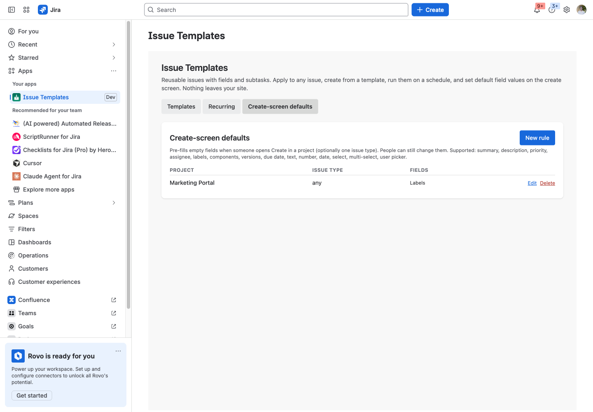

# Issue Templates & Defaults for Jira

Reusable issue templates with fields and subtasks, recurring issues, and default field values on the create screen, per project and issue type.

Runs entirely on Atlassian: no vendor servers, no data egress. Support: support@llmgraph.ai.

## Before you start

- Jira Cloud (Software, Work Management, Service Management) site, and the permission to install apps (site or product admin).
- No accounts or credentials outside Atlassian are needed.

## 1. Install the app on your Jira site.

## 2. Open any issue that has the structure you want, choose Actions (…), Save as template. Name it; subtasks come along.

## 3. Or build one from scratch under Apps, Issue Templates, New template: pick fields, set values, add subtasks. Summary and description accept {{date}}, {{month}}, {{year}} and {{week}}.

## 4. Apply it: on any issue, Actions, Apply template. Empty fields are filled; tick Overwrite to replace existing values; subtasks are created under the issue.

## 5. Create from it: in the library, Create issue, pick project and issue type.

## 6. Recurring: in the Recurring tab schedule a template daily, weekly or monthly (UTC); the app creates the issue and subtasks when due.

## 7. Defaults on create: in the Create-screen defaults tab, pick a project (and optionally an issue type) and the values to pre-fill. Empty fields on the Create dialog get those values; people can still change them.

## What the app stores

Templates (name, description, project scope, raw field values as they are written to Jira, subtask summaries and descriptions); recurring schedules (cadence, project, issue type, next run, last issue key or error); defaults rules (project id, issue type id, field values); the id of the app's own UI modification. Field values can include whatever an admin typed, including user account ids for assignee defaults.

## Limits

Create-screen defaults cover the field types the UI modifications API supports (summary, description, priority, assignee, reporter, labels, components, versions, due date, text, number, date, select, multi-select, user picker). Cascading selects and some app-provided fields are reported as unsupported. Up to five UI-modification apps can act on one project and issue type; beyond that Jira ignores the rest.

## Troubleshooting

| Symptom | Cause | Fix |
|---|---|---|
| Nothing appears after install | The app has not been configured yet | Follow steps 2 to 4 above |
| A person does not see what an admin configured | They lack permission on the underlying content; the app never widens access | Grant the Atlassian permission first |
| An action fails with an HTTP error in the message | Jira or Confluence rejected the request (permission, validation, rate limit) | The message quotes the endpoint and status; retry after fixing the cause or contact support with the text |

## Permissions the app asks for

- `storage:app`: templates, defaults, schedules
- `read:jira-work`: issue read (save-as capture), createmeta / editmeta, fields, projects
- `write:jira-work`: PUT /issue/{key} (apply), POST /issue (create-from / subtasks / recurring) The jira:uiModifications module REQUIRES the full classic scope group (read:jira-user, read:jira-work, manage:jira-configuration, write:jira-work, manage:jira-project) — a platform rule, not a choice. The app itself never calls a configuration or project-management endpoint; the two manage:* scopes exist only to satisfy that module.
- `read:jira-user`: 
- `manage:jira-configuration`: 
- `manage:jira-project`: 
- `read:app-data:jira`: 
- `write:app-data:jira`: /rest/api/3/uiModifications — register the create-screen contexts that the defaults apply to (app-owned data, no customer data)
