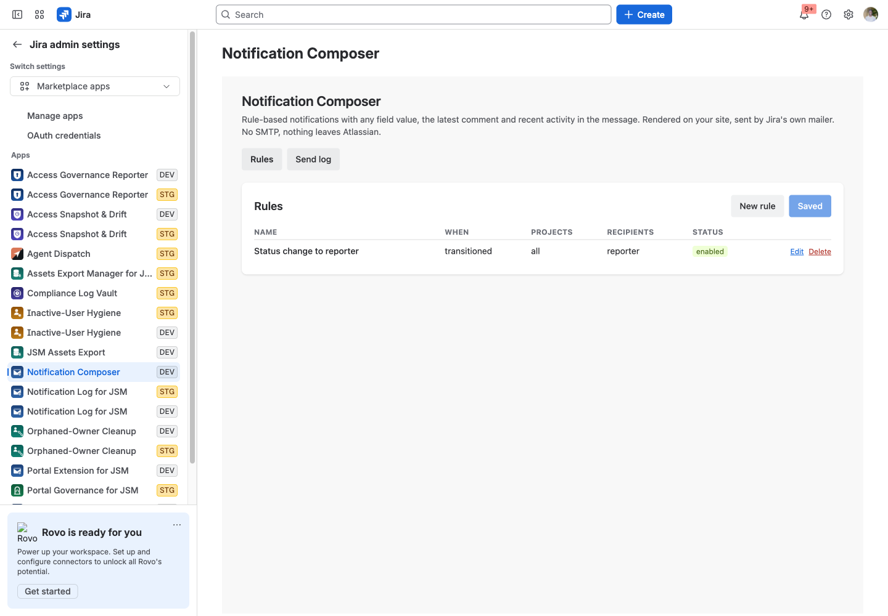
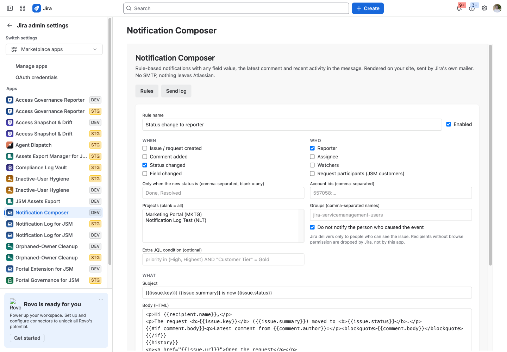
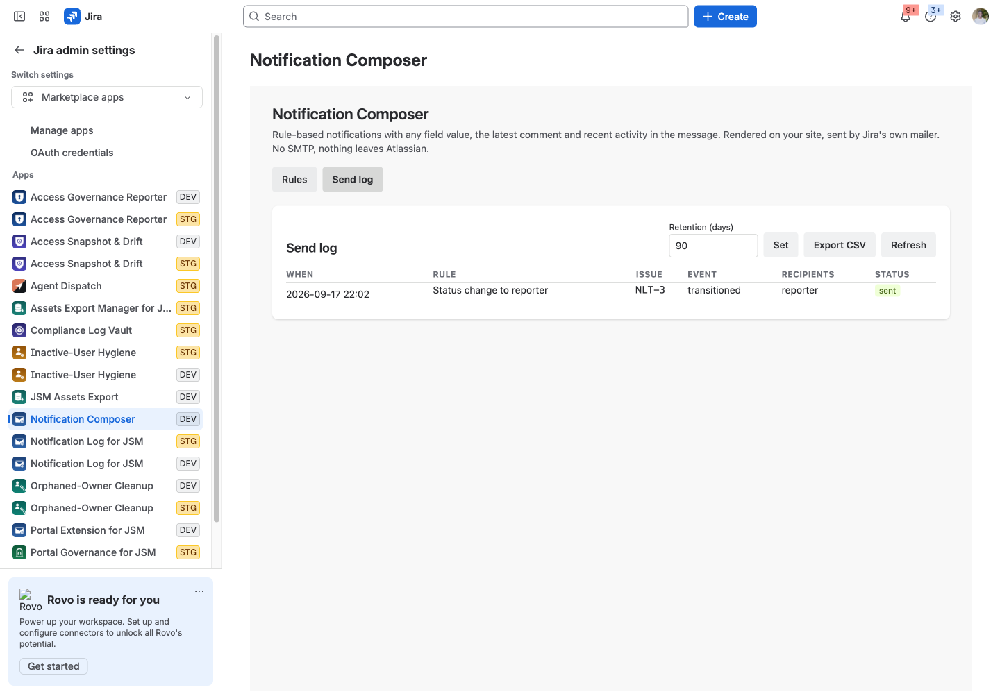

# Notification Composer for Jira

Rule-based notifications with any field value, the latest comment and recent activity in the message, sent through Jira's own mailer. No SMTP, nothing leaves your site.

Runs entirely on Atlassian: no vendor servers, no data egress. Support: support@llmgraph.ai.

## Before you start

- Jira Cloud and Jira Service Management site, and the permission to install apps (site or product admin).
- No accounts or credentials outside Atlassian are needed.

## 1. Install the app on your Jira site (Jira admin).

## 2. Open Jira administration, Apps, Notification Composer, then New rule.

## 3. Choose when it fires (created, comment added, status changed, field changed), the projects, and optionally an extra JQL condition.

## 4. Choose who receives it: reporter, assignee, watchers, JSM request participants, specific account ids or groups. Leave "do not notify the person who caused the event" on.

## 5. Write the subject and HTML body with placeholders such as {{issue.summary}}, {{field.customfield_10042}}, {{comment.body}}, {{transition.to}} and {{history}}. Use Preview against a real issue key, then Send test to me.

## 6. Tick Enabled, Save changes. The Send log tab shows every send with its recipients and Jira's response; export it as CSV.

## What the app stores

Rules (event filters, project keys, JQL text, recipient account ids and group names, subject and body templates); a send log entry per attempt (issue key, rule name, event kind, rendered subject line, a recipient summary such as "reporter, 2 users", status and Jira's error text); a small dedupe marker per event and rule; the retention setting. Rendered bodies are not stored. Log retention is admin-set (default 90 days) and pruned daily.

## Limits

Messages are delivered by Jira through POST /rest/api/3/issue/{key}/notify, so Jira's rules apply: only people who can browse the issue receive it, and the sender address is Jira's. The From address cannot be customised.

## Troubleshooting

| Symptom | Cause | Fix |
|---|---|---|
| Nothing appears after install | The app has not been configured yet | Follow steps 2 to 4 above |
| A person does not see what an admin configured | They lack permission on the underlying content; the app never widens access | Grant the Atlassian permission first |
| An action fails with an HTTP error in the message | Jira or Confluence rejected the request (permission, validation, rate limit) | The message quotes the endpoint and status; retry after fixing the cause or contact support with the text |

## Permissions the app asks for

- `storage:app`: rules, send log, dedupe markers
- `read:jira-work`: issue + changelog + comments for rendering; /rest/api/3/field; JQL condition check via /rest/api/3/search/jql
- `write:jira-work`: POST /rest/api/3/issue/{key}/notify — the ONLY write the app performs. It asks Jira to send a notification; nothing on the issue changes.
- `read:jira-user`: /rest/api/3/user/bulk (display names in the log), /rest/api/3/myself
- `read:servicedesk-request`: GET /rest/servicedeskapi/request/{key}/participant — "customers" recipient group on JSM requests
