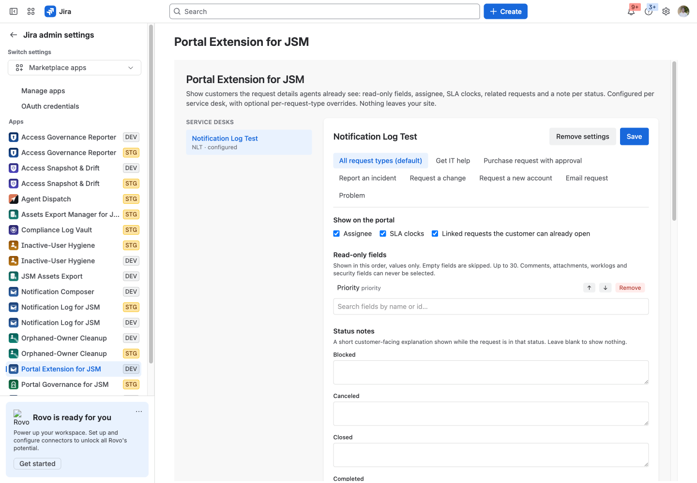
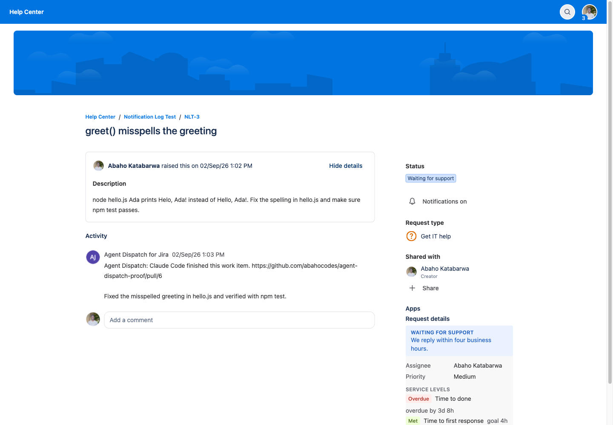

# Portal Extension for JSM

Show customers the request details agents already see: read-only fields, assignee, SLA clocks, related requests, status notes.

Runs entirely on Atlassian: no vendor servers, no data egress. Support: support@llmgraph.ai.

## Before you start

- Jira Service Management (Jira Cloud) site, and the permission to install apps (site or product admin).
- No accounts or credentials outside Atlassian are needed.

## 1. Install the app on your Jira site (Jira admin).

## 2. Open Jira administration, Apps, Portal Extension for JSM.

## 3. Pick a service desk. Under "All request types (default)" tick Assignee, SLA clocks and Linked requests, and search for the fields you want customers to see. Drag them into order.

## 4. Optionally write a short note per status ("Waiting for support: we reply within four business hours").

## 5. For a request type that needs a different set, open its tab and choose Override.

## 6. Save. Open any request on the customer portal as a customer: the "Request details" panel appears under the request.

## What the app stores

Per-service-desk configuration only: selected field ids, three toggles, status-note text written by the admin, keyed by Jira project id. No request data, no customer data and no personal data is stored. Request data is read at page-view time and rendered, never persisted.

## Limits

Panels render beside the native request form; they cannot restyle or hide native fields such as the Share control. Comments, attachments, worklogs and security fields can never be selected.

## Troubleshooting

| Symptom | Cause | Fix |
|---|---|---|
| Nothing appears after install | The app has not been configured yet | Follow steps 2 to 4 above |
| A person does not see what an admin configured | They lack permission on the underlying content; the app never widens access | Grant the Atlassian permission first |
| An action fails with an HTTP error in the message | Jira or Confluence rejected the request (permission, validation, rate limit) | The message quotes the endpoint and status; retry after fixing the cause or contact support with the text |

## Permissions the app asks for

- `storage:app`: Forge KVS: per-desk panel configuration
- `read:jira-work`: GET /rest/api/3/issue/{key} (fields + links), /rest/api/3/field, /rest/api/3/project/{key}/statuses
- `read:servicedesk-request`: GET /rest/servicedeskapi/servicedesk, .../requesttype, .../request/{key} (the as-user access check), .../request/{key}/sla
