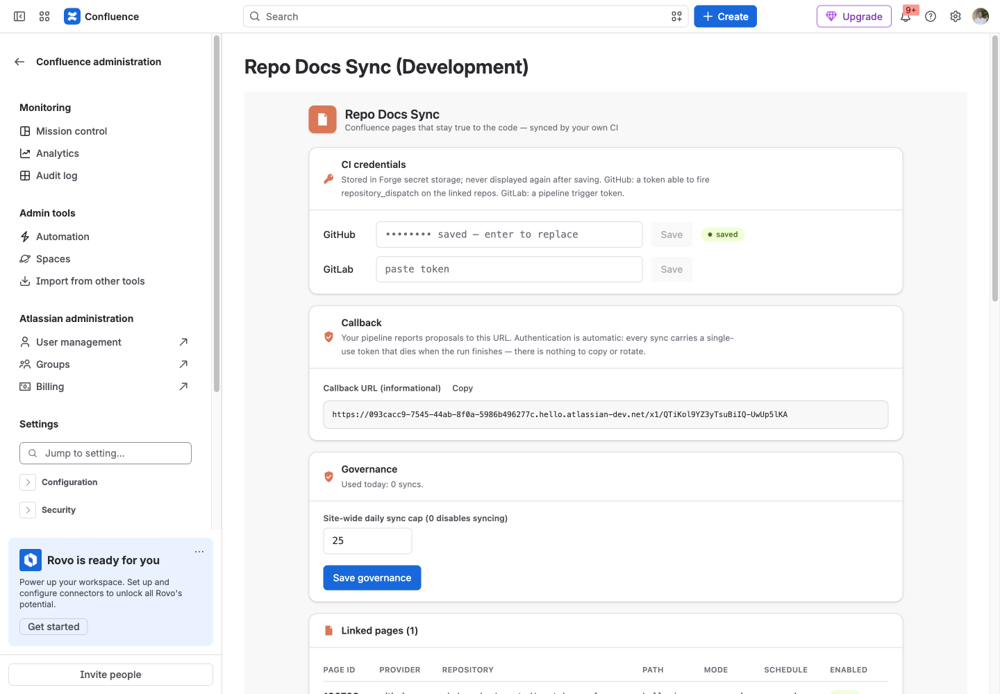
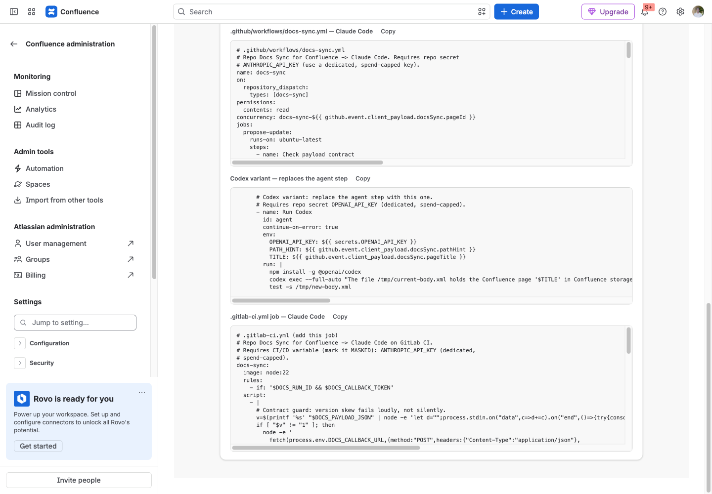
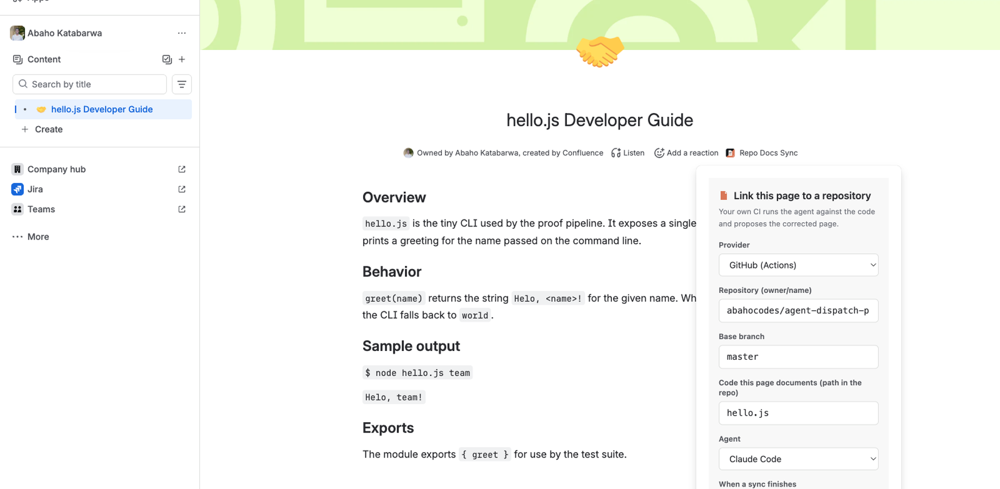
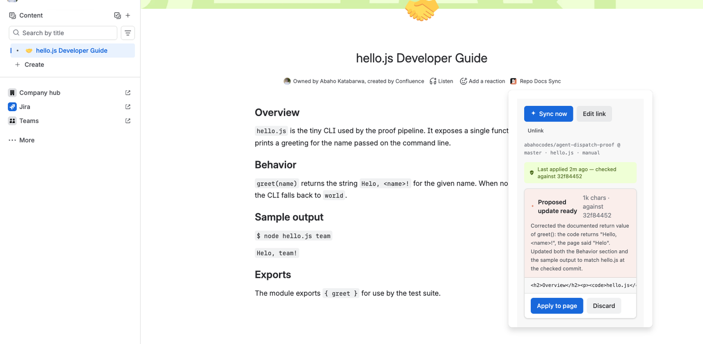
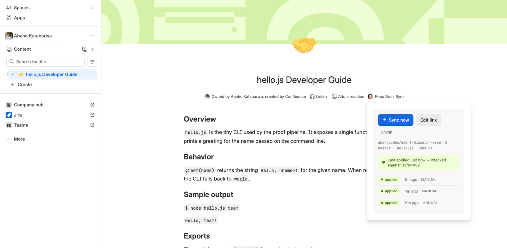
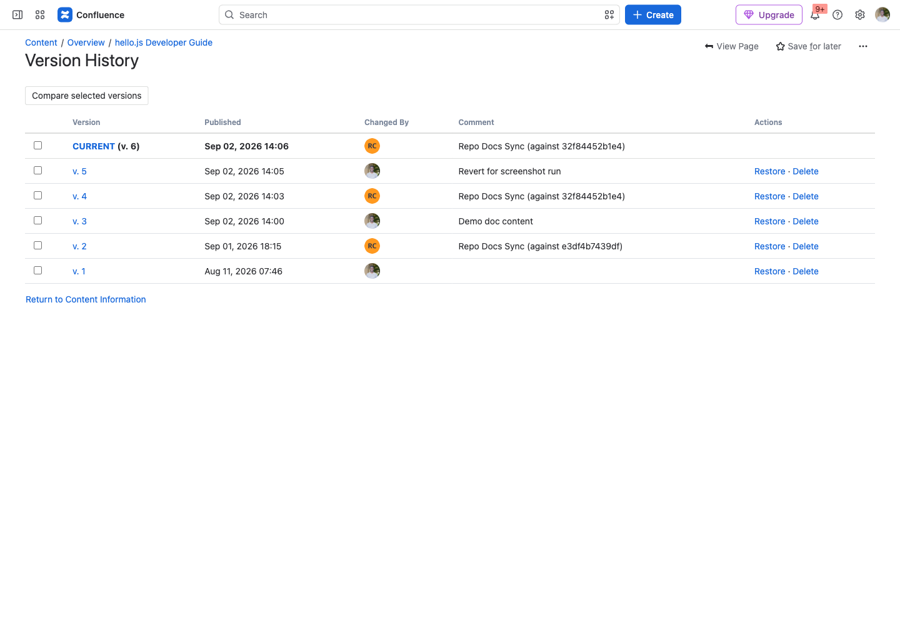
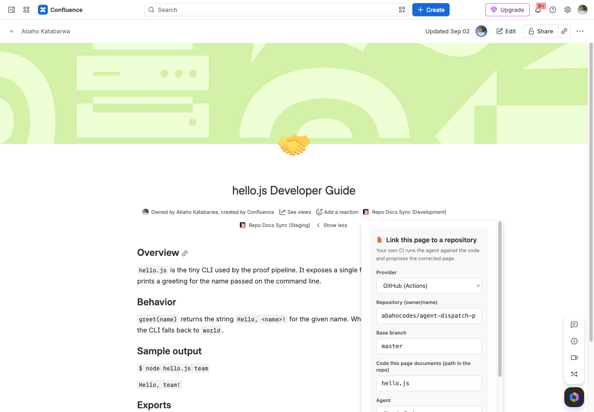
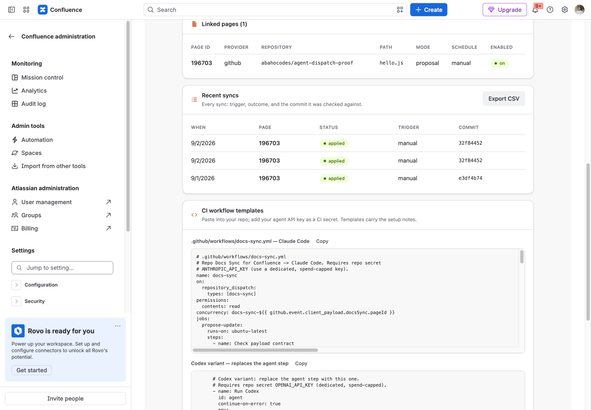

# Repo Docs Sync for Confluence — Setup & Usage

Keep Confluence pages true to the code they document. Link a page to a repository path; on demand or on a schedule, your own CI (GitHub Actions or GitLab CI) runs your AI coding agent against the checked-out code and proposes the corrected page. You review the proposal and apply it as a new page version, stamped with the commit it was checked against. We operate no servers.

> Marketplace listing name: **Repo Docs Sync for Confluence**. App key: `dev.katabarwalabs.docs-sync-agent`.
> Support: **support@llmgraph.ai**.

**Contents**

1. [How it works](#how-it-works)
2. [Before you start](#before-you-start)
3. [Step 1: Install the app](#step-1-install-the-app)
4. [Step 2: Save your CI credential (site admin)](#step-2-save-your-ci-credential-site-admin)
5. [Step 3: Prepare the repository](#step-3-prepare-the-repository)
6. [Step 4: Link a page](#step-4-link-a-page)
7. [Step 5: Run the first sync and apply the proposal](#step-5-run-the-first-sync-and-apply-the-proposal)
8. [Schedules and direct apply](#schedules-and-direct-apply)
9. [Admin page: linked pages, audit log, CSV](#admin-page-linked-pages-audit-log-csv)
10. [Permissions and governance](#permissions-and-governance)
11. [Troubleshooting](#troubleshooting)
12. [Data and privacy](#data-and-privacy)
13. [Testing the app on a scratch repository](#testing-the-app-on-a-scratch-repository)

## How it works

1. A page editor links the page to the repository path it documents (for example `src/api/` or `docs/setup.md`).
2. **Sync now** (or the daily or weekly schedule) sends the current page body to your CI: a `repository_dispatch` event on GitHub, a pipeline trigger on GitLab.
3. In **your** CI runner, the agent (Claude Code or Codex) checks out the repository, compares the page against the actual code, and returns a corrected page body over a single-use callback.
4. The result lands as a **proposal**: a reviewable update with a change summary and the commit hash. A human applies it in one click; the page version history reads "Repo Docs Sync (against `<commit>`)". Direct apply is opt-in per page, and a human edit made mid-sync always wins: the app never overwrites a page that changed.

Nothing runs on our side. The app's only network calls go to `api.github.com` and `gitlab.com`, and the only data that leaves your site is the body of a page someone explicitly linked, sent to the pipeline you configured.

## Before you start

You need:

- A **Confluence Cloud** site and a **Confluence administrator** to install the app and store the CI credential.
- A **GitHub repository with Actions enabled**, or a **GitLab project with CI/CD**, containing the code the page documents.
- **One CI credential** for the app (stored once, site-wide):
  - GitHub: a [fine-grained personal access token](https://github.com/settings/personal-access-tokens/new) scoped to the repositories you will link, with repository permissions **Contents: Read and write** (needed to fire `repository_dispatch`) and **Workflows: Read and write** (needed only if you want the one-click **Install workflow** button to commit the workflow file for you).
  - GitLab: a [pipeline trigger token](https://docs.gitlab.com/ee/ci/triggers/) for the project (Settings → CI/CD → Pipeline trigger tokens).
- **An agent API key** stored as a secret in the repository's CI, never in Confluence: `ANTHROPIC_API_KEY` for Claude Code or `OPENAI_API_KEY` for Codex. Use a dedicated, spend-capped key; the agent runs with it in the CI environment.

## Step 1: Install the app

1. Open the Marketplace listing and choose **Try it free** (or **Get it now**), then pick the Confluence site.
2. Accept the requested scopes (listed under [Permissions and governance](#permissions-and-governance)).
3. After installation the app adds two surfaces: a **Repo Docs Sync** item in the byline under every page title, and an admin page at **Confluence administration → Apps → Repo Docs Sync**.

## Step 2: Save your CI credential (site admin)

Open **Confluence administration → Apps → Repo Docs Sync**.

1. Under **CI credentials**, paste your GitHub token or GitLab trigger token and press **Save**. The token goes into Forge secret storage inside your own site and is never displayed again; the field shows "saved" afterwards. You can save one of each.
2. Under **Governance**, set the **site-wide daily sync cap**. The default is 25; `0` disables syncing entirely.
3. **Callback** is informational. Your pipeline reports proposals to the URL shown, and authentication is automatic: every sync carries a single-use token that dies when the run ends. There is nothing to copy or rotate.

The "Get set up" checklist at the top of the page ticks itself off as you complete the steps below.

## Step 3: Prepare the repository

The CI job that runs the agent lives in your repository. Two things must be in place, once per repository:

**A. The workflow file.**

- GitHub, the easy way: when you link a page (Step 4), the byline dialog checks the repository and, if the `docs-sync` workflow is missing, shows an **Install workflow** button that commits `.github/workflows/docs-sync.yml` to the default branch for you. This needs the token's Workflows permission.
- GitHub, by hand: copy the template from the admin page's **CI workflow templates** card into `.github/workflows/docs-sync.yml` and commit it. For Codex, replace the "Run Claude Code" step with the Codex variant shown beneath it.
- GitLab: add the `docs-sync` job from the **.gitlab-ci.yml** template to your pipeline definition.

The workflow is read-only on the repository (`permissions: contents: read`); it never pushes. It checks out the base branch without persisting credentials, writes the page body to a temp file, runs the agent, and posts the corrected body back to the callback.

**B. The agent key.**

- GitHub: Settings → Secrets and variables → Actions → **New repository secret**: `ANTHROPIC_API_KEY` (Claude Code) or `OPENAI_API_KEY` (Codex).
- GitLab: Settings → CI/CD → Variables: `ANTHROPIC_API_KEY`, marked **Masked**.

## Step 4: Link a page

Open any page and click **Repo Docs Sync** in the byline under the title. On a page that is not linked yet, the dialog opens on the link form.

| Field | What to enter |
|-------|---------------|
| **Provider** | GitHub (Actions) or GitLab (CI). |
| **Repository** | `owner/name` on GitHub, or the numeric project ID or `group/project` path on GitLab. |
| **Base branch** | The branch the agent checks out and compares against, for example `main`. |
| **Code this page documents** | A path inside the repository: a directory such as `src/api/` or a file such as `docs/setup.md`. The agent is told to read this path. |
| **Agent** | Claude Code or Codex. Must match the key you stored in the repository. |
| **When a sync finishes** | **Store a proposal for review** (recommended) or **Apply to the page immediately**. See [Schedules and direct apply](#schedules-and-direct-apply). |
| **Schedule** | Manual, Daily, or Weekly. |

Press **Save**. The dialog then checks the repository setup live. If the workflow is missing you will see the **Install workflow** button described in Step 3; if no GitHub token has been saved yet, it says so and points you to the admin page.

Only users with **edit permission on the page** can link, sync, apply or discard. Viewers see status only.

## Step 5: Run the first sync and apply the proposal

1. In the byline dialog press **Sync now**. The run shows as **queued**, then **running** while your CI job executes. A typical run takes one to three minutes depending on the agent and the size of the code path.
2. When the job reports back, the dialog shows **Proposed update ready** with the agent's change summary, the size of the new body, the commit it was checked against, and a preview of the first part of the corrected page.

3. Press **Apply to page** to publish the proposal as a new page version, or **Discard** to drop it. Applying re-checks that the page has not been edited since the sync snapshot; if it has, the apply is refused and you re-sync instead.
4. After applying, the dialog shows "Last applied ... checked against `<commit>`" and the run history for the page.

5. The page's **Version history** records each applied sync as "Repo Docs Sync (against `<commit>`)", so anyone can see which commit the page was last checked against.

To change the link later, open the byline dialog and press **Edit link**; **Unlink** removes it.

## Schedules and direct apply

- **Manual**: syncs only when someone presses Sync now.
- **Daily** and **Weekly**: a scheduled job fires the sync for every enabled link on schedule, subject to the site-wide daily cap. A link whose run fails keeps its slot until the next period, so a broken repository degrades to one failed run per period, not a retry storm.
- **Apply to the page immediately** (direct mode): the corrected body is applied as soon as the CI job reports back, without a review step. Even in direct mode, if a person edited the page while the sync was running, the app refuses to overwrite and keeps the result as a proposal instead. Use direct mode for pages that are generated from code anyway, such as reference docs; keep proposal mode for pages people write by hand.

## Admin page: linked pages, audit log, CSV

The admin page lists every linked page on the site (page ID, provider, repository, path, mode, schedule, enabled) and a **Recent syncs** table with trigger, outcome and commit for every run. **Export CSV** downloads the full audit log.

## Permissions and governance

| Scope | Why |
|-------|-----|
| `read:page:confluence` | Read the linked page body for the sync payload, and check the calling user's page permissions. |
| `write:page:confluence` | Apply an accepted proposal as a new page version. |
| `storage:app` | Store page links, run history, proposals and the CI credential (Forge secret storage) in your own site. |

External egress declared in the manifest: `api.github.com` and `gitlab.com` only. Forge enforces this at the platform level; no other destination is reachable.

- **Page edit permission** is required for every mutation (linking, syncing, applying, discarding); it is checked as the acting user and fails closed.
- **Daily sync cap** is site-wide and set on the admin page.
- **Per-run callback tokens** are single-use and expire when the run ends. The CI job never holds Confluence credentials.
- **Version guard**: applying checks the page version the proposal was generated against.
- **Stale runs** whose pipeline never reported back are swept to `failed` automatically by an hourly job.

## Troubleshooting

| Symptom | Cause and fix |
|---------|---------------|
| Byline dialog says **No GitHub token saved yet** | Save a token on the admin page (Step 2), then reopen the dialog. |
| **The docs-sync workflow is not installed** | Press **Install workflow** (GitHub, needs Workflows permission on the token) or commit the template by hand. GitLab: add the `docs-sync` job to `.gitlab-ci.yml`. |
| Sync stays **queued** and nothing happens in CI | The dispatch did not reach the repository: wrong `owner/name`, a token without Contents write on that repository, or Actions disabled. Check the repository's Actions tab; the run is swept to failed within the hour. |
| Sync **failed** with agent output attached | Usually a missing or expired `ANTHROPIC_API_KEY` / `OPENAI_API_KEY` secret, or the agent hit its spend cap. The output is shown in the dialog. |
| **Workflow/app contract mismatch** | The workflow file is from an older app version. Reinstall it from the byline dialog or paste the current template. |
| **The page has been edited since this proposal was generated** | Someone changed the page after the sync snapshot. Re-sync for a fresh proposal against the current page. |
| **Daily cap reached** | Raise the site-wide cap on the admin page, or wait for the next day. |
| Proposal preview looks truncated | The preview shows the first 4,000 characters; the full body is applied. Very large pages are sent to CI truncated (flagged in the payload) because of provider payload limits; the agent still reads the full code. |

## Data and privacy

The app stores page links, run records, proposals (chunked) and your CI credential (Forge secret storage) inside your own Atlassian site. What leaves your tenant: the linked page's content, sent to the CI pipeline you configured when a sync fires. This app is not part of the "Runs on Atlassian" program because egress to your CI is the product.

Claude Code is a trademark of Anthropic, PBC. Codex is a trademark of OpenAI. This app is not affiliated with Anthropic, OpenAI, GitHub, or GitLab.

## Testing the app on a scratch repository

The fastest end-to-end test, about ten minutes:

1. Create a small public or private GitHub repository with one source file, for example `hello.js` exporting `greet(name)` that returns `Hello, <name>!`.
2. Create a Confluence page that documents it, and deliberately get one detail wrong (say the page claims the function returns `Helo, <name>!`).
3. Add `ANTHROPIC_API_KEY` (or `OPENAI_API_KEY`) as a repository secret.
4. Save a fine-grained token for that repository on the admin page (Step 2).
5. Link the page to the repository with path `hello.js` (Step 4), let the dialog install the workflow, then press **Sync now**.
6. Within a few minutes a proposal appears correcting the wrong detail, with the commit hash. Apply it and check the page's version history.

Questions or issues: **support@llmgraph.ai**, or via https://katabarwalabs.dev/support.
