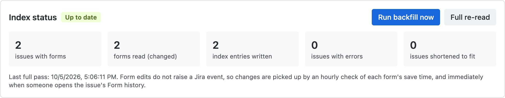
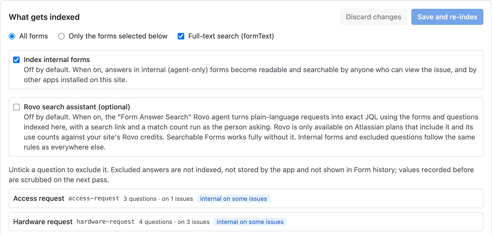
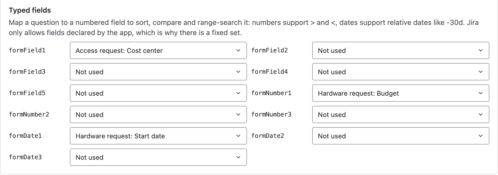
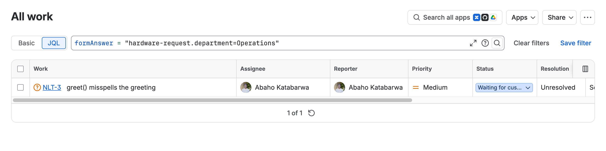
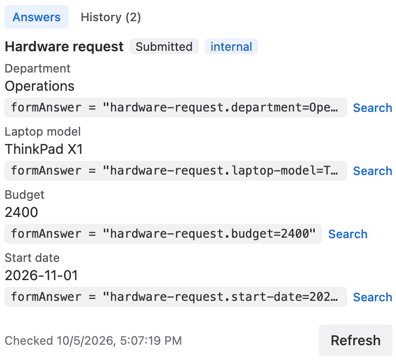
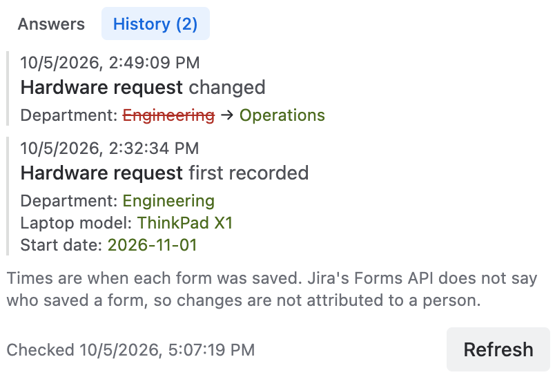

# Searchable Forms for JSM

Find requests by what people answered in Jira Forms, in JQL, saved filters, dashboards, queues and automation, including answers to questions that are not linked to a Jira field. Every request also gets a Form history panel that shows what changed in a form and when.

Runs entirely on Atlassian: no vendor servers, no data egress. Forms are only read, never changed. Support: support@llmgraph.ai.

> Marketplace listing name: **Searchable Forms for JSM**. App key: `dev.katabarwalabs.jsm-searchable-forms`.

## Before you start

- A Jira Cloud site with Jira Service Management and Jira Forms, and a **Jira administrator** to install and configure the app.
- No accounts or credentials outside Atlassian are needed.
- Rovo is **not** required. The optional Rovo assistant (step 7) needs a plan that includes Rovo.

## 1. Install the app on your Jira site (Jira admin).

From the Marketplace listing choose **Try it free** and your site, then approve the scopes listed at the end of this page. Free for up to 10 users, then per-user pricing billed by Atlassian.

## 2. Open Jira settings, Apps, Searchable Forms, and select Run backfill now.

The backfill reads the forms on your existing requests and writes one search entry per issue. The status card shows progress and turns to **Up to date** when the pass finishes. After that, the app checks each form's save time every hour and updates only what changed.

## 3. Choose what gets indexed, then Save and re-index.

- **All forms** or **Only the forms selected below**.
- **Full-text search (formText)** on or off.
- **Index internal forms** is off by default. Read "Who can see indexed answers" below before you turn it on.
- Untick any question that holds sensitive data. Excluded answers are not indexed, not stored by the app and not shown in Form history; values recorded earlier are scrubbed on the next pass.

## 4. Optional: map questions to typed fields for ranges and sorting.

Pick a question for `formNumber1..3` (numbers), `formDate1..3` (dates) or `formField1..5` (text) and save. These support `>`, `<`, relative dates and `ORDER BY`. Jira only allows fields the app declares, which is why the set is fixed.

## 5. Search in JQL.

Open **Filters, Search work items**, switch to **JQL** and use the app's fields. Keys are the form and question names in lower case with dashes ("Laptop model" becomes `laptop-model`). Leave out the form name to match any form. Matching is not case sensitive.

| Find | JQL |
|---|---|
| A given answer on one form | `formAnswer = "hardware-request.department=Finance"` |
| A given answer on any form | `formAnswer = "department=Finance"` |
| Issues with a form attached | `formName = "access-request"` |
| Issues where a question was answered | `formQuestion = "access-request.cost-center"` |
| Words anywhere in the answers | `formText ~ "laptop"` |
| Numbers above a value (after step 4) | `formNumber1 > 1000 ORDER BY formNumber1 DESC` |
| Dates in the last 30 days (after step 4) | `formDate1 >= -30d` |
| Combined with normal JQL | `project = HELP AND formAnswer = "priority-level=urgent" AND created >= -7d` |

Save any query as a filter to use it in dashboards, queues and automation conditions. If another app on your site uses the same field names, the long form always works: `issue.property[searchable-forms].answers = "department=Finance"`.

## 6. Open a request and expand Form history in the sidebar.

**Answers** shows the current answers, each with the exact JQL that finds it and a Search link. **History** shows a timeline: which answers changed, from what, to what, and when the form was saved, plus when a form was reopened, submitted or removed. Opening the panel also refreshes that issue's index immediately. The panel appears in service projects only.

## 7. Optional: turn on the Rovo search assistant.

On the admin page, tick **Rovo search assistant (optional)** and save. The **Form Answer Search** agent then turns plain-language requests ("requests where department is Operations", "budget over 1000 in the last 3 months") into the exact JQL, with a search link and a match count run with the asking person's own permissions. It only uses forms and questions the app has indexed and follows the same rules for internal forms and excluded questions. It is off by default, needs a plan that includes Rovo, and uses your site's Rovo credits. Everything else in the app works without it.

## Who can see indexed answers

- Indexed answers are stored in the issue property `searchable-forms`. **Anyone who can view the issue can read it**, and so can other apps installed on your site that can read issues. That is how Jira issue properties work. Choose what to index with that in mind.
- **Internal (agent-only) forms are not indexed by default.** If you turn them on, their answers become readable and searchable in the same way. In the Form history panel, internal forms are shown only to agents of the service project.
- **Exclude sensitive questions** (step 3). Their answers are never indexed or stored, and saving an exclusion scrubs values recorded earlier on every issue, even if the form is later renamed.
- When an issue is deleted, the app deletes its stored copy and history for that issue.
- Uninstalling does not remove the `searchable-forms` property from existing issues, because Jira keeps app-written issue properties. An admin can remove it with `DELETE /rest/api/3/issue/{issueIdOrKey}/properties/searchable-forms`, or ask us for a script.

## What the app stores

In Forge storage inside your site: the configuration from steps 3, 4 and 7; a catalog of form and question names; per issue, a copy of the current answers (excluded questions redacted) and up to 200 history rows; sweep progress. On each issue: the `searchable-forms` property described above. Nothing leaves your site.

## Limits

- **Freshness:** Jira raises no event when a form is edited, so search reflects an edit after the next hourly check, or immediately when someone opens the issue's Form history. New requests are picked up about a minute after creation.
- **No "who" in history:** Jira's Forms API does not say who saved a form, so changes show their time, not a person.
- Each answer token is matched on its first 255 characters (the panel gives the exact query). Full-text search covers each answer's first 2,000 characters, within Jira's size limit for one issue's search entry.
- Double quotes and backslashes in answers are ignored when indexing.
- Typed fields are a fixed set: 5 text, 3 number, 3 date.
- User-picker answers are indexed by account id; the panel shows names.
- Large sites: one hourly pass reads one form list per issue with forms; very large sites run several chained slices per pass and honour Jira's rate limits.

## Troubleshooting

| Symptom | Cause | Fix |
|---|---|---|
| JQL finds nothing right after install | The backfill has not run or is still running | Step 2: Run backfill now and wait for **Up to date** |
| A recent form edit is not found | Form edits fire no Jira event | Wait for the hourly check, or open the issue's Form history to refresh it now |
| An internal form's answers are not found | Internal forms are off by default | Tick **Index internal forms** (step 3) after reading "Who can see indexed answers" |
| `formNumber1 > 1000` returns nothing | No question is mapped to that slot, or the answers are not plain numbers | Map the question in step 4 and save; answers like `$1,000` are not numbers |
| JQL says the field does not exist | Another app uses the same field name, or the app is not installed | Use `issue.property[searchable-forms].answers = "..."` |
| The Rovo agent says search is turned off | The admin toggle is off (the default) | Step 7 |
| Admin page shows issues with errors | Jira refused a read (permission or rate limit) on some issues | They are retried on the next pass; contact support with the admin page text if it persists |

## Permissions the app asks for

- `storage:app`: Forge storage for configuration, catalog, per-issue copy and history, sweep progress.
- `read:jira-work`: Forms REST API reads (`GET /forms/issue/{id}/form` and `/form/{formId}`), `POST /rest/api/3/search/jql` to find issues with forms, `GET /rest/api/3/field` (finds the "Total forms" field), `GET /rest/api/3/issue/{id}` (project and existence), `GET` of the app's own property (read-back check), `GET /rest/api/3/serverInfo` (search links), and, as the signed-in user, `GET /rest/api/3/mypermissions` and `POST /rest/api/3/permissions/project` (admin, browse and agent checks) and `POST /rest/api/3/search/approximate-count` (Rovo match count).
- `write:issue.property:jira`: `PUT /rest/api/3/issue/{id}/properties/searchable-forms`, the app's only write. It cannot change issue fields or forms.
- `read:jira-user`: `GET /rest/api/3/user/bulk`, as the viewer, to show names for user-picker answers in the panel. Never stored.

## Data handling

All computation runs on Atlassian Forge inside your Jira Cloud site. There is no external server and no data egress, which is why the app is eligible for the "Runs on Atlassian" badge. Privacy policy: https://katabarwalabs.dev/privacy. Security policy: https://katabarwalabs.dev/security.
